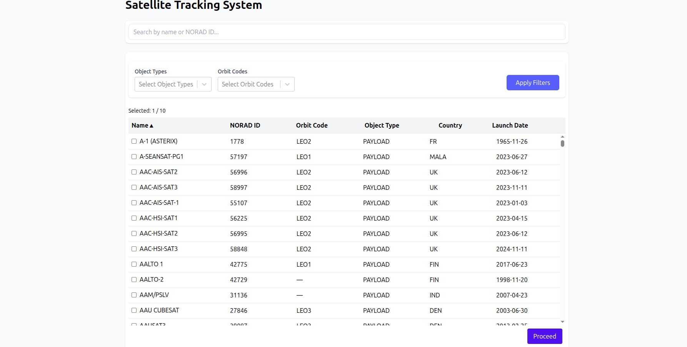
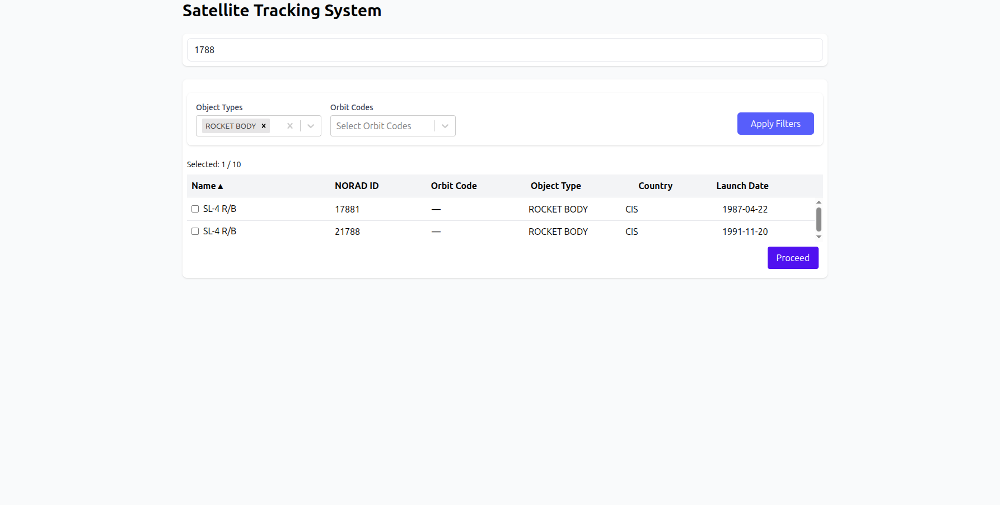
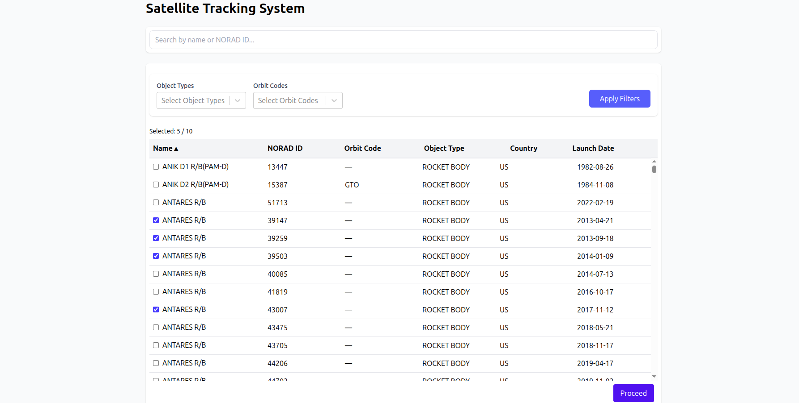

# Satellite Tracking App

A React + TypeScript application to search, filter, and analyze satellite data. Built with a focus on clean UI, optimized rendering, and local state persistence.

## Tech Stack

- **Framework:** React + TypeScript
- **Styling:** TailwindCSS
- **Virtualization:** tanstack/react-virtual
- **Table & Sorting:** tanstack/react-table
- **Form & Filter Control:** react-hook-form, react-select
- **API Client:** Axios
- **Others:** lodash.debounce, localStorage, React Router

---

##  Features

###  Filtering
- Filter by Object Type (multi-select)
- Filter by Orbit Code
- "Apply Filters" action to trigger updates

###  Table
- Virtualized rendering using `@tanstack/react-virtual` for smooth performance on large datasets
- Sortable columns (ascending / descending) using `@tanstack/react-table`
- Clean column layout with fixed widths

###  Search
- Debounced input (via `lodash.debounce`) for satellite name or NORAD ID
- Case-insensitive and partial match supported

###  Sorting
- All table columns support sorting
- Toggle between ascending, descending, and default
- Implemented using `@tanstack/react-table`


###  Row Selection
- Each row has a checkbox
- Max 10 rows can be selected
- Selected count displayed
- Error message shown on exceeding limit

###  Persistence
- Selected rows saved to `localStorage`
- On "Proceed", app navigates to second page
- Second page displays list of selected satellite `name` and `noradCatId`
- Data persists on reload

---

##  Code Quality

- Modular folder structure with separation of concerns
- Type-safe data using `Satellite` interface
- Reusable components with clean logic
- Performance optimized: Virtualization + Debouncing
- Minimal and readable JSX

---

## Installation & Running Locally

1. Clone the repository:
```bash
git clone git@github.com:SamhithMR/drt_react_samhith.git
```

2. Install dependencies:
```bash
cd drt_react_samhith
npm install
```

3. Start the development server:
```bash
npm start
```

The application will be available at `http://localhost:3000`


## 🔗 Live Demo

[Live Demo Link (https://frolicking-pastelito-a577e7.netlify.app)](https://frolicking-pastelito-a577e7.netlify.app/)

> ⚠️ Note: Running the app in production may not work as expected due to CORS errors from the backend API. Use the local version for full functionality.


## Screenshots





